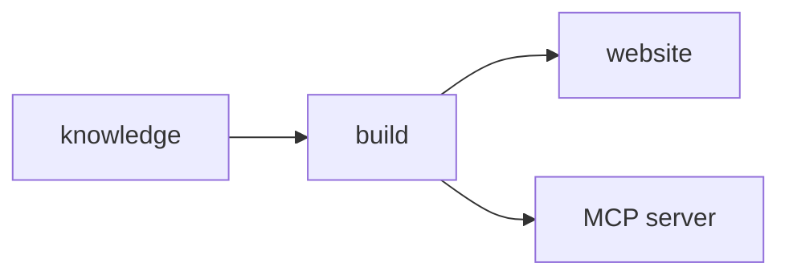

# What a Document Can Carry

A governed document is markdown first, and prose alone compiles to both surfaces. Everything on this
page is optional: each primitive exists for one thing plain paragraphs cannot do, and a record that
never reaches for any of them is a finished record.

<HighlightTip />

## A task the reader is meant to carry out

Reading a definition is not the same as having applied it. A task card marks work to be done and
gives it an identifier the rest of the record can point at.

<ExerciseCard id="EX-01" title="Write one abstention note for a document you own" />

## Terms worth holding in the head

Definitions are the part of a record that has to be recalled rather than looked up. The deck below
is authored as a plain YAML file beside this document, so the recall material travels with the prose
it came from instead of living in a separate system.

<Flashcards />

## Two answers to the same question

The argument for a governed source is easiest to see side by side: one answer grounded in the
record, one improvised from general knowledge — both delivered in the same confident voice.

<ConversationGallery />

## A figure

A diagram is published beside the prose rather than in place of it, and a reader can open it to full
size when the detail is what matters.

## A diagram written rather than drawn

The other kind of figure is one the document generates from its own source, so it stays reviewable
in a diff like every other line here.

## One instruction, four machines

Some steps differ by machine. The tab vocabulary is configuration rather than markup, so the
document states the difference once and each reader opens only the line that applies to them.

::::os-tabs

::windows
Open `build\index.html` from the file explorer.

::windows-wsl
Open `build/index.html` from the Windows side of the file system.

::macos
Run `open build/index.html`.

::linux
Run `xdg-open build/index.html`.

::::

## Where the vocabulary stops

The set is deliberately small. A primitive earns its place by being something a writer would
otherwise have to leave markdown to say — and none of them changes what the record *is*.
